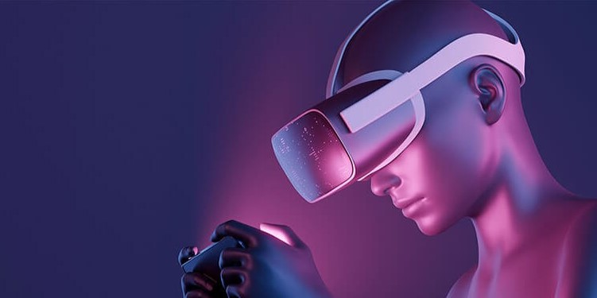

<!DOCTYPE html>
<html lang="en">
<head>
    <meta charset="UTF-8">
    <meta name="viewport" content="width=device-width, initial-scale=1.0">
    <link href="https://cdn.jsdelivr.net/npm/bootstrap@5.3.3/dist/css/bootstrap.min.css" rel="stylesheet" integrity="sha384-QWTKZyjpPEjISv5WaRU9OFeRpok6YctnYmDr5pNlyT2bRjXh0JMhjY6hW+ALEwIH" crossorigin="anonymous">
</head>
<body>

    

<table style="width: 100%; text-align: justify;">
  <tbody>
    <tr>
      <td>
      <b>About Me</b> 👋Hello! I’m Ermiyas Abate, a passionate computer programmer based in [Your Location]. With a background in both Bachelor’s and Master’s degrees in Computer Science, I’ve been immersed in the world of code and algorithms for quite some time.  
      <b>What I Do</b> 🚀 Currently, I’m diving deep into the fascinating realms of machine learning and data science. The idea of teaching computers to learn from data and make intelligent decisions captivates me. Whether it’s wrangling messy datasets, training neural networks, or exploring statistical models, I’m always up for a good challenge.</td>
      <td>
      <b>My Toolbox</b> 
      🛠️ Here are some of the tools and technologies I wield:
      <b>Languages:</b> Python, Java, C++ 
      <b>Frameworks:</b> TensorFlow, PyTorch 
      <b>Data Manipulation:</b> Pandas, NumPy 
      <b>Visualization:</b> Matplotlib, Seaborn 
      <b>Version Control:</b> Git (of course!) 
      <b>IDEs:</b> Visual Studio Code, Jupyter Notebook
</td>
    </tr>
  </tbody>
</table>

</body>
</html>